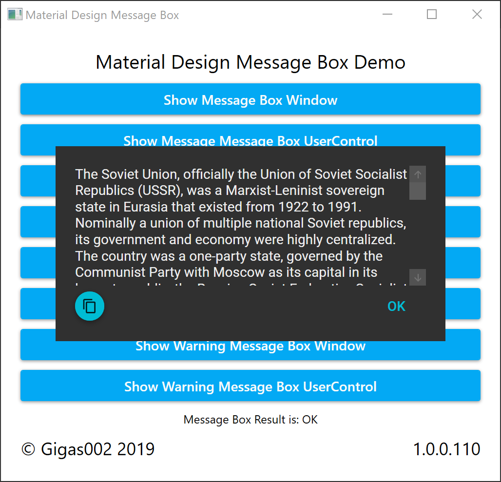
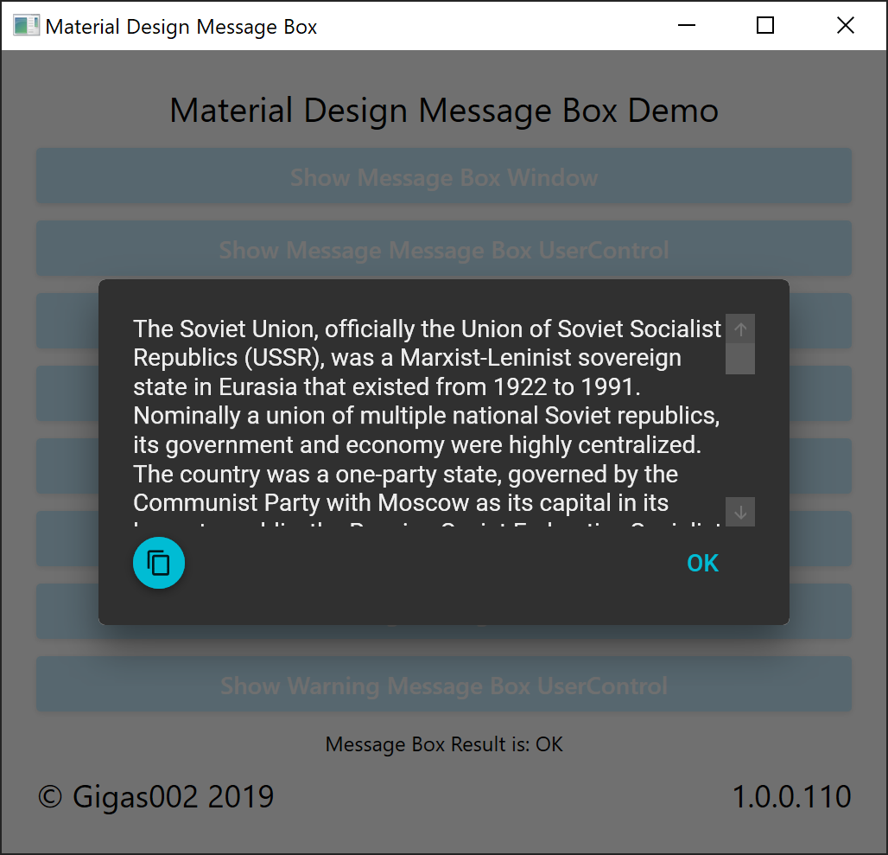
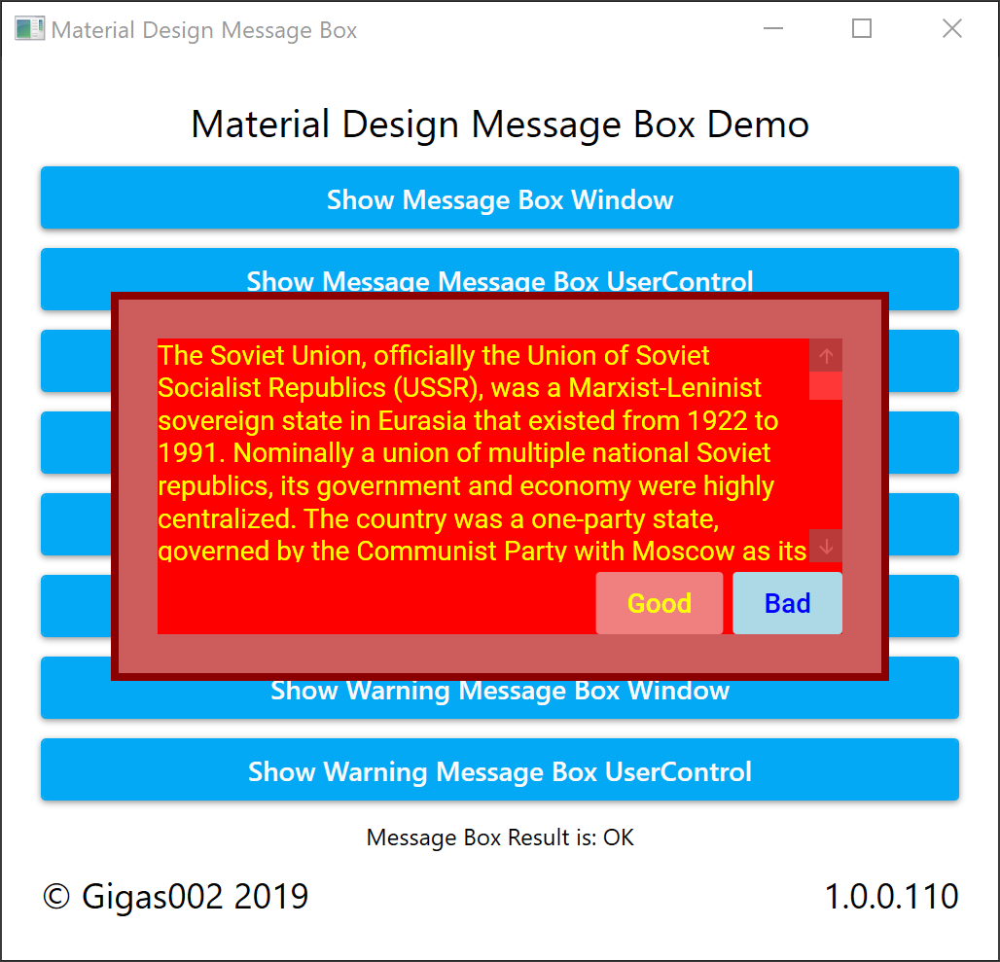
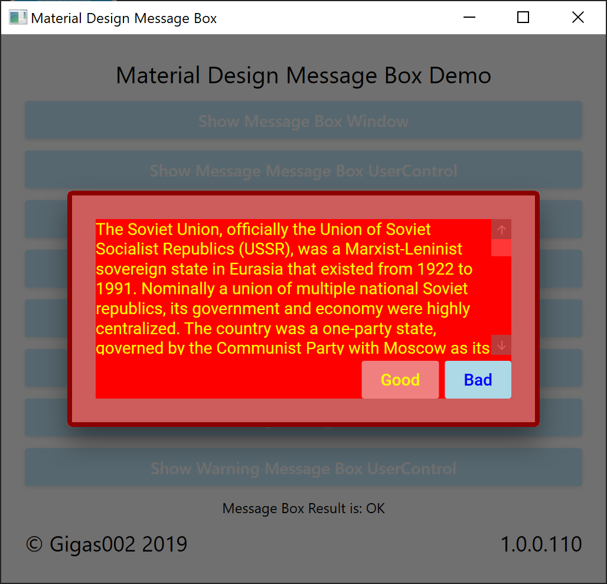
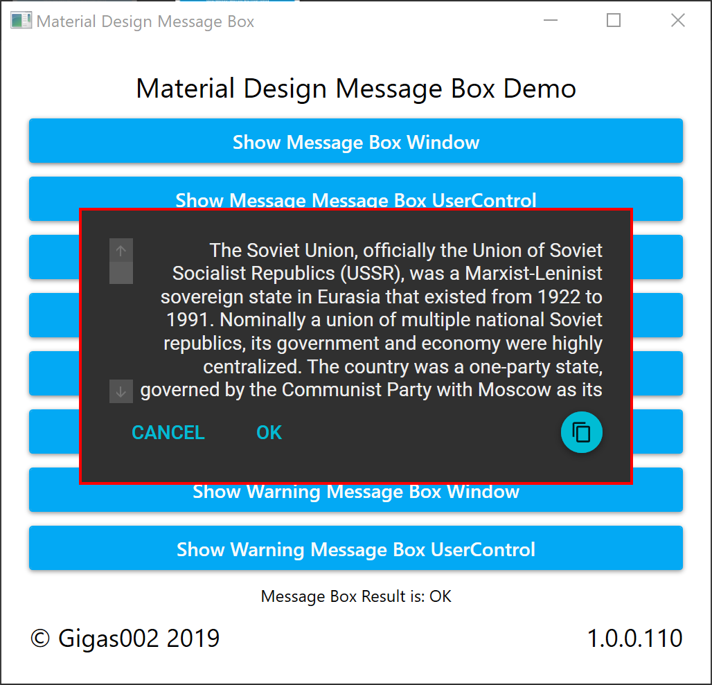
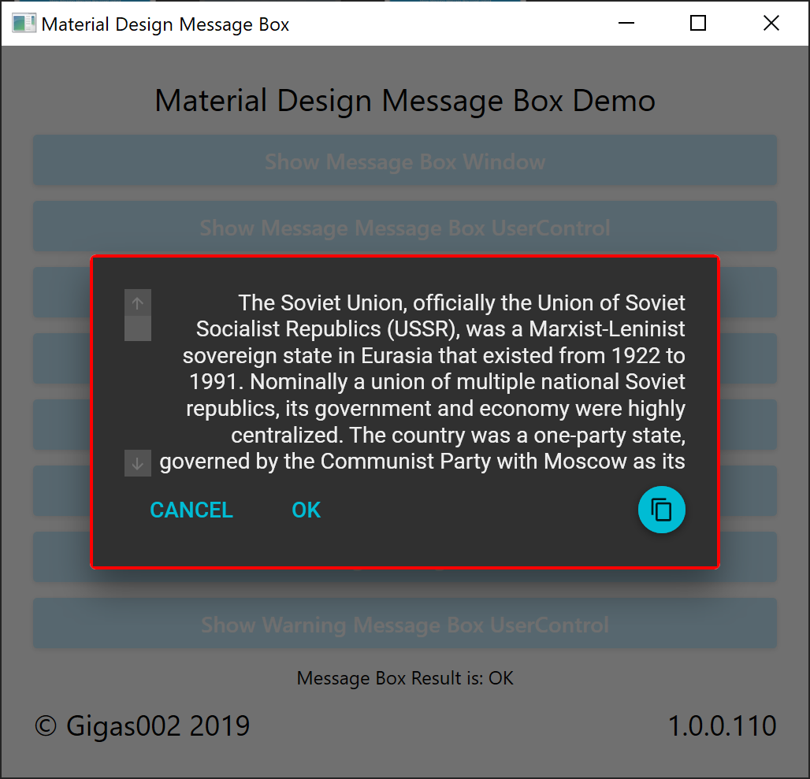
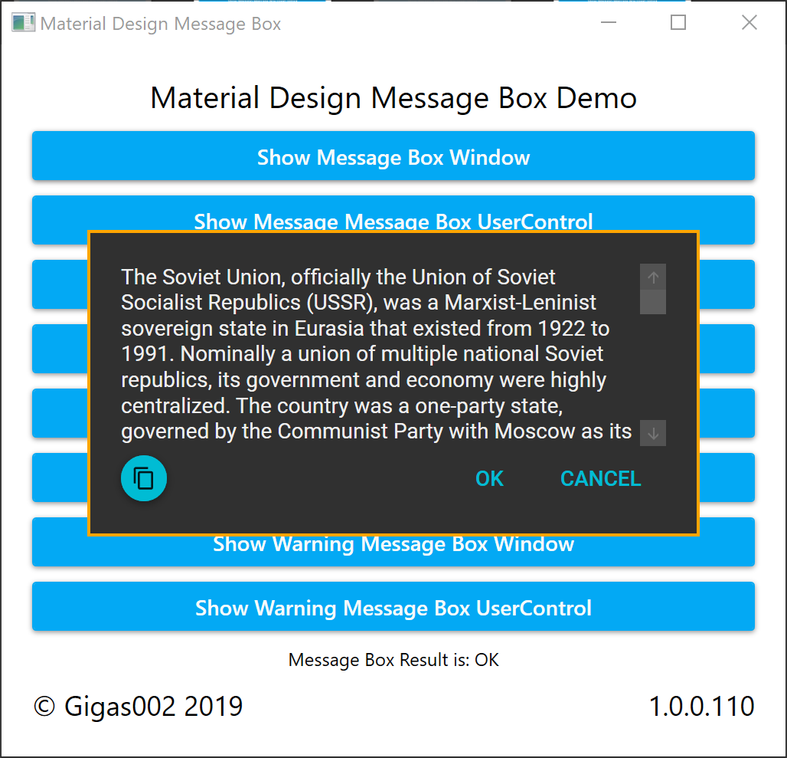
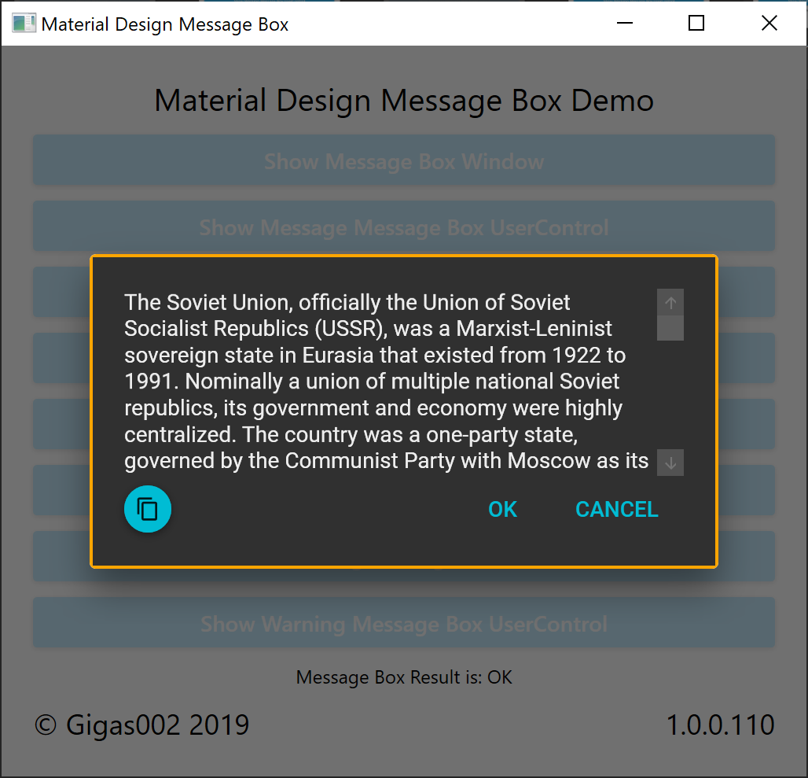

# MaterialMessageBox

Library on **.NET Core 3.0** (**preview9**) implementing material design message box in WPF.

Original idea and some code is written by [denpalrius](https://github.com/denpalrius/Material-Message-Box), but I’ve changed some major stuff and decided to make it different repository. Text for message boxes in Demo is taken from [here](https://en.wikipedia.org/wiki/Soviet_Union). Icon is taken from [here](https://material.io/resources/icons/?search=message&icon=message&style=baseline).

You can build project in **VS2019** (**16.2.4**+) or in **VSCode** (**1.38.0**+) with [omnisharp-vscode](https://github.com/OmniSharp/omnisharp-vscode) extension (**1.21.2**+).


[](https://ci.appveyor.com/project/Gigas002/materialmessagebox)

## Current version

Get latest version on releases page: [](https://github.com/Gigas002/MaterialMessageBox/releases/latest), or on NuGet:

Windows x86: [](https://www.nuget.org/packages/MaterialMessageBox-x86/)

Windows x64: [](https://www.nuget.org/packages/MaterialMessageBox-x64/)

Information about changes since previous releases can be found in [changelog](https://github.com/Gigas002/MaterialMessageBox/blob/master/CHANGELOG.md). This project supports [SemVer 2.0.0](https://semver.org/) (template is `{MAJOR}.{MINOR}.{PATCH}.{BUILD}`).

Previous versions can be found on [releases](https://github.com/Gigas002/MaterialMessageBox/releases) and [branches](https://github.com/Gigas002/MaterialMessageBox/branches) pages.

## Requirements

- Windows 7 or newer;
- .NET Core 3.0 preview9 or newer;

## Dependencies

- [MaterialDesignThemes](https://www.nuget.org/packages/MaterialDesignThemes) – 3.0.0-ci534;
- [MaterialDesignColors](https://www.nuget.org/packages/MaterialDesignColors) – 1.2.1-ci534;

## API

Library implements two different kinds of message boxes: **Window** and **UserControl**. See screenshots below to see the difference in design.

To use API, add `using MaterialMessageBox` directive to your classes.

### MaterialMessageBoxWindow

Contains three slightly different static `Show(...)` methods:

```c#
public static MessageBoxResult Show(string message, bool isCancelButtonVisible = false, bool isRightToLeft = false) {...}

public static MessageBoxResult ShowError(string message, bool isCancelButtonVisible = false, bool isRightToLeft = false) {...}

public static MessageBoxResult ShowWarning(string message, bool isCancelButtonVisible = false, bool isRightToLeft = false) {...}
```

Which you can call in your code like this:

```c#
MaterialMessageBoxWindow.Show(MessageBoxMessage);
MaterialMessageBoxWindow.ShowError(MessageBoxMessage, true, true);
MaterialMessageBoxWindow.ShowWarning(MessageBoxMessage, true);
```

But also you can create `MaterialMessageBoxWindow` object and rewrite some stuff for yourself:

```c#
MaterialMessageBoxWindow materialMessageBoxWindow = new MaterialMessageBoxWindow
{
    MessageTextBlock = { Text = MessageBoxMessage, Foreground = Brushes.Yellow },
    CopyToClipboardButton = { Visibility = Visibility.Hidden },
    OkButton = { Content = "Good", Foreground = Brushes.Yellow, Background = Brushes.LightCoral},
    CancelButton = { Content = "Bad", Foreground = Brushes.Blue, Background = Brushes.LightBlue},
    BordersGrid = { Background = Brushes.IndianRed },
    MainGrid = { Background = Brushes.Red }, BorderBrush = Brushes.DarkRed,
    BorderThickness = new Thickness(4, 4, 4, 4)
};
materialMessageBoxWindow.ShowDialog();
```

### MaterialMessageBoxUserControl

To use this, you must specify `DialogHost` in your `.xaml` file.

Code is mostly the same, as in `MaterialMessageBoxWindow`, but there’s also implemented both `Async` and non-`Async` methods:

```c#
public static async ValueTask<MessageBoxResult> ShowAsync(string message, bool isCancelButtonVisible = false, bool isRightToLeft = false) {...}

public static async ValueTask<MessageBoxResult> ShowErrorAsync(string message, bool isCancelButtonVisible = false, bool isRightToLeft = false) {...}

public static async ValueTask<MessageBoxResult> ShowWarningAsync(string message, bool isCancelButtonVisible = false, bool isRightToLeft = false) {...}

public static MessageBoxResult Show(string message, bool isCancelButtonVisible = false, bool isRightToLeft = false) {...}

public static MessageBoxResult ShowError(string message, bool isCancelButtonVisible = false, bool isRightToLeft = false) {...}

public static MessageBoxResult ShowWarning(string message, bool isCancelButtonVisible = false, bool isRightToLeft = false) {...}
```

Ways to call it are pretty much the same (don’t forget to make your methods `async` and use `ConfigureAwait`):

```c#
await MaterialMessageBoxUserControl.ShowAsync(MessageBoxMessage);
await MaterialMessageBoxUserControl.ShowErrorAsync(MessageBoxMessage, true, true);
await MaterialMessageBoxUserControl.ShowWarningAsync(MessageBoxMessage, true)
```

And of course you can also create `MaterialMessageBoxUserControl` object, but note, that **there’s a bit different way to call `Show()` method**:

```c#
MaterialMessageBoxUserControl materialMessageBoxUserControl = new MaterialMessageBoxUserControl
{
    MessageTextBlock = { Text = MessageBoxMessage, Foreground = Brushes.Yellow },
    CopyToClipboardButton = { Visibility = Visibility.Hidden },
    OkButton = { Content = "Good", Foreground = Brushes.Yellow, Background = Brushes.LightCoral },
    CancelButton = { Content = "Bad", Foreground = Brushes.Blue, Background = Brushes.LightBlue },
    BordersGrid = { Background = Brushes.IndianRed },
    MainGrid = { Background = Brushes.Red },
    BorderBrush = Brushes.DarkRed,
    BorderThickness = new Thickness(4, 4, 4, 4)
};
await DialogHost.Show(materialMessageBoxUserControl);
```

## Screenshots

Usual Window



Usual UserControl



Custom Window



Custom UserControl



Error Window



Error UserControl



Warning Window



Warning UserControl



## Contributing

Feel free to contribute, make forks, change some code, add [issues](https://github.com/Gigas002/MaterialMessageBox/issues), etc.
